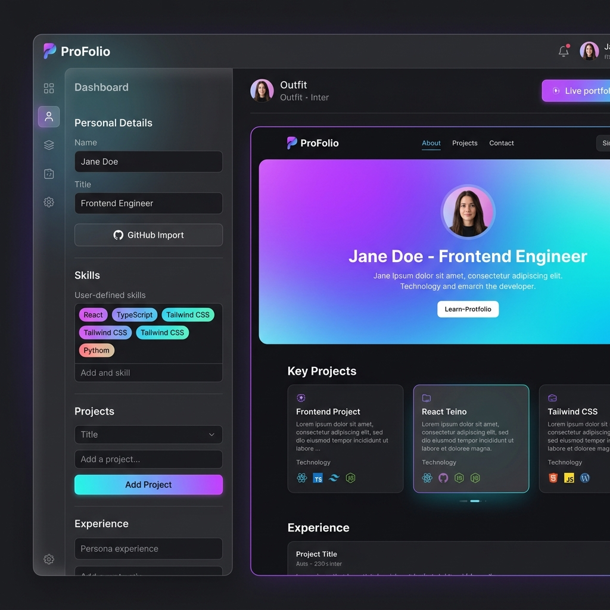
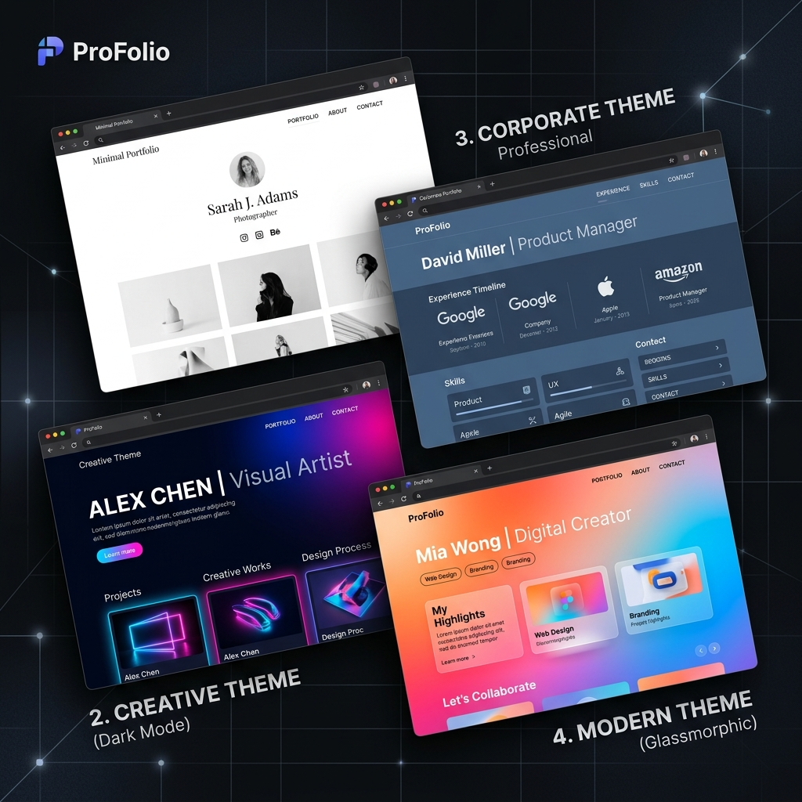
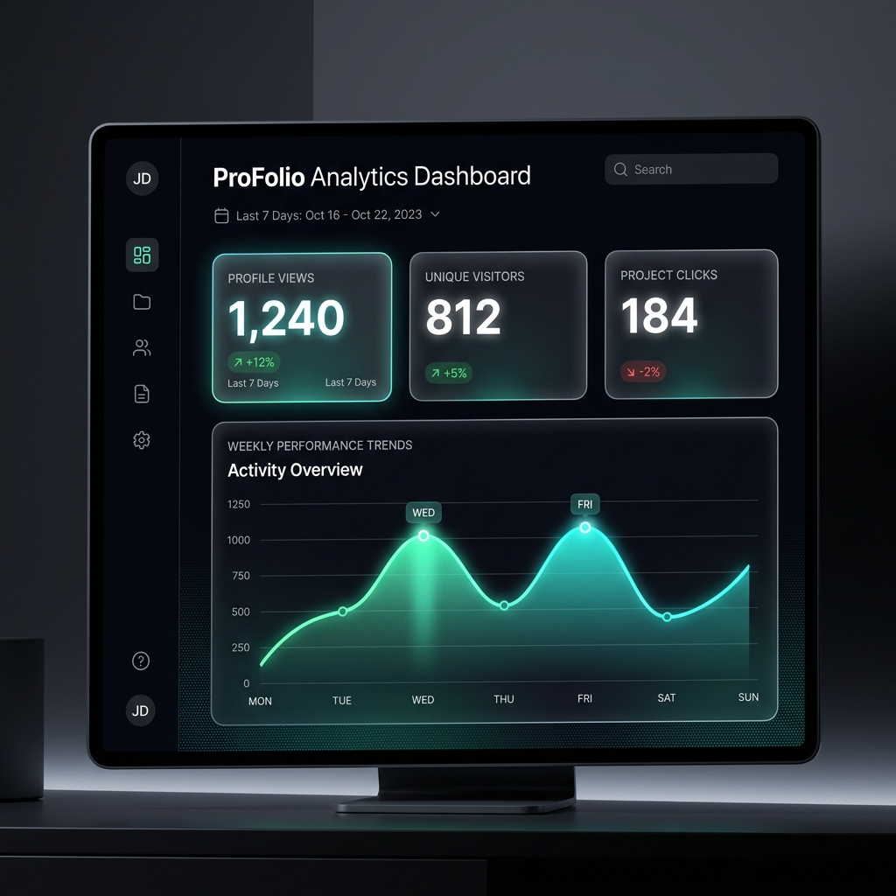

# 🚀 ProFolio | Premium Portfolio Builder

<p align="center">
  
</p>

<h3 align="center">ProFolio</h3>

<p align="center">
  <strong>Build a stunning, professional portfolio website in minutes.</strong> No-code setup, real-time interactive preview, PDF resume parsing, GitHub integration, and one-click static exports.
</p>

<p align="center">
  
  
  
  
  
</p>

---

## 🌟 Visual Showcase

### 1. Interactive Editor & Live Preview
Create, modify, and fine-tune your portfolio details on the left, and watch your portfolio automatically render, style, and animate inside a real-time side-by-side device preview.


### 2. Premium Custom Themes
Toggle between four curated, responsive layout designs specifically tailored for different professional goals, complete with dedicated light/dark variants:
* **Minimalist** — Clean typography, airy grids, and subtle borders.
* **Creative** — Loud typography, high contrast, rotated badge elements, and thick playful borders.
* **Corporate** — Structured experience timelines, serif-focused headers, and sleek navy accents.
* **Modern** — Dynamic frosted-glass effects (glassmorphism), glowing neon blurs, and elegant interactive scales.


### 3. Analytics & Portfolio Manager
ProFolio features a full-fledged authentication and user database simulated securely on the client. Save, update, and manage multiple portfolios from a dashboard equipped with rich traffic tracking.


---

## ✨ Features

* **📄 Smart Resume Parser (PDF)** — Drag-and-drop your existing PDF resume! Using client-side `pdf.js` content rendering and heuristic pattern mapping, ProFolio instantly extracts and populates your name, bio, skills, professional work history, and academic experience.
* **🐙 GitHub Projects Sync** — Enter your GitHub username and instantly pull your top public repositories, languages, descriptions, and direct source links with a single click.
* **🎨 Modern Responsive Themes** — Fully responsive designs styled beautifully with modern design systems (Inter & Outfit fonts, curated HSL color maps, neomorphic buttons, and sleek CSS transitions).
* **🖥️ Interactive Mode Switcher** — Seamless dark-mode and light-mode toggling for all themes.
* **💾 Pure Static Export** — Download your completed portfolio as a highly optimized, single-file static HTML bundle, completely ready to host on **GitHub Pages**, **Vercel**, or **Netlify**!
* **📊 Simulated Analytics Dashboard** — Monitor profile views, unique visitors, and project clicks through animated SVG bar charts and responsive metric displays.

---

## 🛠️ Technology Stack

* **Build Tool:** [Vite](https://vite.dev/)
* **Logic:** Vanilla ES6+ JavaScript (Modular structure)
* **Styling:** Custom Vanilla CSS (Responsive variables, glassmorphic filters, neomorphic gradients)
* **Resume Parsing:** [PDF.js](https://mozilla.github.io/pdf.js/) (Client-side extraction)
* **Data Persistence:** LocalStorage (Simulated accounts, portfolios, and dashboard metrics)
* **Deployment:** Pre-configured for seamless static page builds

---

## 📂 Project Structure

```bash
Portfolio_Builder/
├── docs/                      # Documentation and visual assets
│   └── images/                # High-fidelity mockups for README
├── public/                    # Static assets
│   ├── favicon.svg            # Site icon
│   └── icons.svg              # Theme icons
├── src/                       # Application source code
│   ├── assets/                # App-specific images and SVGs
│   ├── auth.js                # LocalStorage user auth and portfolio manager
│   ├── counter.js             # Utility scripts
│   ├── main.js                # State management, sidebar views, DOM actions
│   ├── parser.js              # Heuristic PDF text processor and regex parser
│   ├── style.css              # Glassmorphic editor & preview workspace styles
│   └── template.js            # Dynamic HTML generator for portfolio themes
├── index.html                 # Entry HTML template
├── package.json               # Dependencies and scripts
└── vite.config.js             # Development configurations
```

---

## 🚀 Getting Started

Follow these steps to run the application locally on your machine.

### Prerequisites

Make sure you have [Node.js](https://nodejs.org/) installed.

### Installation

1. **Clone the repository:**
   ```bash
   git clone https://github.com/your-username/Portfolio_Builder.git
   cd Portfolio_Builder
   ```

2. **Install dependencies:**
   ```bash
   npm install
   ```

3. **Start the development server:**
   ```bash
   npm run dev
   ```
   Open your browser and navigate to `http://localhost:5173` to see it in action!

4. **Build for production:**
   ```bash
   npm run build
   ```
   This will output optimized static files to the `/dist` directory.

---

## 🛡️ License

This project is licensed under the MIT License - see the [LICENSE](LICENSE) file for details.

---

<p align="center">
  Made with 💜 for developers worldwide. Build yours today!
</p>
